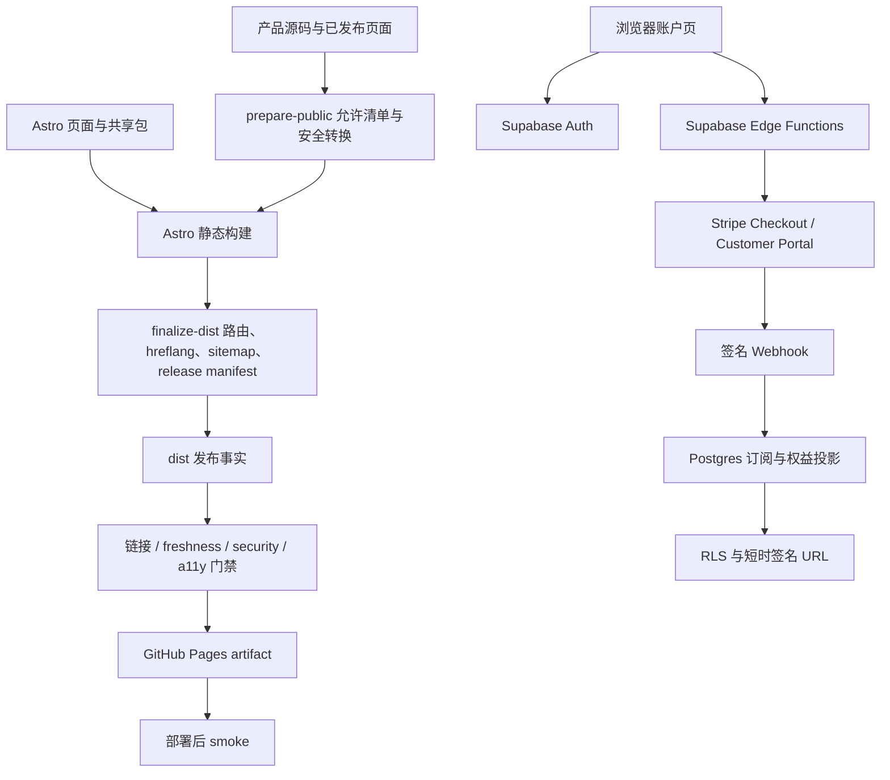

# Sichen Tao Web Product Family v2.0 工程项目书

> 文档版本：2.0-draft<br />
> 核验日期：2026-08-15<br />
> 当前分支：`codex/v2-product-system`<br />
> 基线保护：原始提交已建立 `v1.0` 标记与 `archive/v1.0` 分支
> 发布原则：`main` 只接受通过全部门禁的构建产物；真实账号与付费在独立测试环境完成验收后启用。

## 1. 工程结论

v2.0 的目标架构已经形成：Astro 负责可重现的静态装配；现有产品页面以明确允许清单进入公开产物；共享设计系统将视觉值、基础组件和产品模式分层；Supabase 与 Stripe 提供可复制的身份、计费、权益和学习内核；GitHub Actions 以生成后的 `dist/` 为发布事实。

当前静态工程的构建、链接、安全、类型、设计系统、单元测试和视觉 QA 已有通过证据。Academic Homepage 已将 JavaScript 与 CSS 分片确立为单一事实源，构建阶段生成原有稳定 URL 对应的 monolith，并用故障测试阻止 manifest 与生成物漂移。当前发布阻断项为 Academic Frontier 与 Learning 两个内容 freshness 失败、Supabase/Stripe 沙盒闭环、人工无障碍剩余项和生产 smoke/回滚演练。账户客户端与平台接口已完成字段、请求和响应命名对齐，并加入静态契约自测；真实行为仍需要沙盒端到端验证。

## 2. 现状证据

### 2.1 基线与分支

| 项目          | 当前事实                                                  | 说明                                       |
| ------------- | --------------------------------------------------------- | ------------------------------------------ |
| v1.0 恢复点   | Git tag `v1.0` 与 branch `archive/v1.0` 指向 `b3a5e87a…`  | 原版本可追溯；归档版本不再接收常规功能修复 |
| v2.0 工作分支 | `codex/v2-product-system`                                 | 尚未合并 `main`                            |
| 根包版本      | `2.0.0-alpha.1`                                           | 表示预发布工程状态                         |
| 运行时        | Node.js ≥ 24、pnpm 11.19.0、TypeScript 6.0.3、Astro 7.2.2 | 由 `package.json`、`.nvmrc` 和锁文件约束   |
| 输出模式      | Astro `output: static`                                    | GitHub Pages 只部署 `dist/`                |

### 2.2 当前本地构建产物

当前 `dist/release-manifest.json` 记录 73 个索引公开路由、17 个兼容路由、93 个 `noindex` 证据路由和 0 个 Quant 公开产物。`dist/` 共 324 个文件、22.17 MiB，其中 187 个 HTML 文件的 2,603 个本地引用已通过链接检查。这些数字描述本地生成物，正式发布以目标提交重新构建后的 manifest 为准。

### 2.3 产品数据快照

本节记录 2026-08-15 内容验收结果。Follow Builders 与 JSPS KAKENHI 已完成真实来源刷新和差异核验；Academic Frontier 与 YouTube Learner 保留上一成功快照，并由 freshness 门禁继续阻断。

| 数据域            |                                                                               当前可见规模 | 快照时间                  | 发布判断                                                 |
| ----------------- | -----------------------------------------------------------------------------------------: | ------------------------- | -------------------------------------------------------- |
| Academic Homepage |                                                   52 篇论文、8 个开源项目、11 个外部资料等 | 数据文件 metadata 为准    | 静态结构可用；关键外部信息仍需维护                       |
| Academic Frontier |                                                                          15 篇当前公开论文 | 2026-05-08                | **FAIL**：8 篇候选更新会删除 14 篇现有记录，且缺少审核链 |
| Follow Builders   |                                               26 个 X 来源、6 个播客、2 个博客；34 条 feed | 2026-08-15T06:27:33.693Z  | **PASS**：32 tweets + 1 podcast + 1 blog                 |
| YouTube Learner   |                                                     2 篇文章，均含视频、逐字稿和 EPUB 记录 | 2026-05-15                | **FAIL**：缺少站点专用导入器                             |
| JSPS KAKENHI      | 21 项目 / 7 open / 2 priority；62 timeline / 23 forms / 164 guides / 31 sources / 24 calls | 2026-08-15T18:05:04+09:00 | **PASS**：下一截止时间为 2026-09-17 16:30 JST            |

JSPS 规范构建器已将材料链接标准化为独立记录：当前数据中空材料标题、单字段多 URL 和官方路径双斜线计数均为 0，`priority_program_count` 与 2 个 `priority: true` 项目一致。

## 3. 目标架构



该架构把公开静态内容和用户私有状态分开。GitHub Pages 不处理密钥和用户数据库；浏览器通过 Supabase 公钥建立用户会话；所有需要服务角色或 Stripe Secret 的动作停留在 Edge Functions。

## 4. 仓库结构与责任

| 路径                         | 责任                                            | 禁止事项                             |
| ---------------------------- | ----------------------------------------------- | ------------------------------------ |
| `src/`                       | Astro 根页面、布局、账户交互与 v2 样式          | 放入服务端密钥或私有数据             |
| `assets/shared/`             | 跨产品外壳、语言、主题、字体与导航兼容层        | 添加产品专属业务数据                 |
| `packages/design-tokens/`    | 唯一视觉值、主题、字体、断点和资产基础          | 组件硬编码颜色                       |
| `packages/ui/`               | 可跨框架使用的基础组件与语义契约                | 包含页面文案、路由或支付逻辑         |
| `packages/product-patterns/` | 异步、筛选、阅读、freshness 和 entitlement 模式 | 直接授予服务端权限                   |
| 各产品目录                   | 现有公开页面、数据与产品业务                    | 复制共享图标、字体和通用组件的新版本 |
| `scripts/v2/`                | 发布物检查、smoke 与内容门禁                    | 用全局 ignore 或未来时间消除失败     |
| `supabase/`                  | 数据库、RLS、Edge Functions、seed 与平台测试    | 进入 GitHub Pages `dist/`            |
| `.github/workflows/`         | CI、部署、定时健康检查和回滚                    | 绕过锁文件和必需门禁                 |

## 5. 共享设计系统工程

### 5.1 三层包

1. `@sichentao/design-tokens`：颜色、字体、字号、行高、字重、间距、圆角、阴影、动效、控件高度、宽度、断点和三个主题；
2. `@sichentao/ui`：按钮、图标按钮、字段、卡片、徽标、提示、骨架、状态面板、disclosure 和 DOM 绑定；
3. `@sichentao/product-patterns`：站点外壳、异步边界、筛选账本、资源卡、新鲜度、权限门和长文阅读器。

验证器当前识别 105 个 production-derived 令牌、63 个令牌引用、3 个主题与 5 个核心异步状态，并检查 29 个图标名是否存在于真实 sprite 中。

### 5.2 复用合同

- 视觉值只进入 token；组件和模式使用 `var(--st-*)`；
- 组件只处理结构、样式与语义，文案和业务状态由应用注入；
- 应用负责 URL、语言、数据、授权与支付；
- 客户端 entitlement 只控制展示，数据库和签名 URL 完成最终授权；
- 迁移旧页面时先建立同视口截图基线，再替换重复实现，并运行键盘和状态回归；
- 删除旧 CSS 前证明无引用，并保留一个发布周期的回滚路径。

### 5.3 迁移顺序

1. 导入 token，确认三主题和三语言的 computed style 与基线一致；
2. 替换无业务逻辑的按钮、字段、卡片与状态面板；
3. 迁移筛选账本、阅读器和站点外壳，同时保持 URL 状态；
4. 接入 freshness 与 entitlement 服务端数据；
5. 全站截图、键盘、链接和状态通过后清除无引用旧实现。

每次迁移以一个产品或一个模式为变更单元，避免在同一提交中同时改视觉、数据与支付合同。

## 6. Astro 静态构建

### 6.1 构建流程

```text
pnpm build
  ├─ prebuild → scripts/prepare-public.mjs
  │   ├─ 清空并重建 .generated-public
  │   ├─ 复制允许目录与根资产
  │   ├─ 跳过 README、.DS_Store 和非发布 frontend 源
  │   ├─ 校验 Academic manifest 并从分片生成 app.js / styles.css
  │   ├─ 注入 CSP、canonical、referrer、skip link 与 v2 runtime
  │   ├─ 移除远程 Google Fonts
  │   ├─ 将第三方 HTML snapshot 转为安全证据页
  │   └─ 生成 legacy redirect、robots 和 .nojekyll
  ├─ astro build → dist
  └─ scripts/finalize-dist.mjs
      ├─ 断言 quant-platform 不存在
      ├─ 添加 Frontier hreflang
      ├─ 重建 sitemap
      └─ 写 release-manifest.json
```

### 6.2 Academic Homepage 单一事实源

`academic-homepage/frontend/js/manifest.txt` 按执行顺序登记 15 个 JavaScript 分片，`academic-homepage/frontend/css/manifest.txt` 按层叠顺序登记 11 个 CSS 分片。`scripts/v2/build-academic-homepage.mjs` 在 `prepare-public` 阶段验证路径安全、扩展名、唯一性、文件存在性和目录完整性，再逐字节拼接到 `.generated-public/academic-homepage/app.js` 与 `styles.css`。

删除源码 monolith 前的迁移验证证明，分片结果与当时的两个 tracked 文件逐字节一致：`app.js` 为 236,720 B，SHA-256 为 `f0e94a13097f707a443985095dbc18f617c3153c79677c5be47b0a54513ef4e9`；`styles.css` 为 103,734 B，SHA-256 为 `768d910a61ce98193caf687e5fab74b3b65e31b3c53929f99d823651fe74d9c1`。HTML 继续请求原有 URL，因此该改造不改变页面视觉与加载合同。

源码目录不再保存 `app.js` 或 `styles.css`。构建会拒绝重新引入 monolith；`tests/academic-homepage-build.test.mjs` 同时覆盖正确顺序拼接、不安全或损坏 manifest、遗漏分片、生成物漂移和 monolith 回归。

### 6.3 公开允许清单

只有 `assets`、`academic-homepage`、`academic-frontier`、`follow-builders`、`youtube-to-ebook`、`jsps-kakenhi`、`portal.css` 和 `portal.js` 进入生成 public 目录。`quant-platform` 没有复制路径，并由 finalize 与 security gate 双重断言。

### 6.4 兼容性

- 旧 `/academic/**` 与根级 Academic HTML 路由生成 noindex 兼容跳转；
- `/jsps-kakenhi/calls.html` 跳转到 JSPS 首页；
- 旧资源 URL 在明确需要时保持可解析；
- 兼容页不进入主内容 sitemap；
- 第三方原始 HTML 只在源控制保留 provenance，公开产物用无脚本证据页替换。

## 7. 可复用 Supabase/Stripe 平台

### 7.1 领域模型

15 张业务表分成四个领域：

| 领域       | 表                                                                              | 责任                                            |
| ---------- | ------------------------------------------------------------------------------- | ----------------------------------------------- |
| 身份与产品 | `profiles`、`applications`、`memberships`、`consents`、`audit_events`           | 用户资料、产品注册、角色、同意与审计            |
| 计费与权益 | `billing_customers`、`plans`、`subscriptions`、`entitlements`、`webhook_events` | Stripe 映射、方案、订阅投影、最终权限与幂等账本 |
| 学习       | `learning_items`、`learning_progress`、`bookmarks`、`notes`                     | 课程/视频/文章及用户学习状态                    |
| 内容交付   | `content_assets`                                                                | 私有对象路径、类型、大小与校验信息              |

`applications` 是未来网站的隔离键。新网站注册一个稳定 slug，即可复用同一 Auth、计费、权益和学习 schema；产品成员和权限始终带有 `application_id`。

### 7.2 行级安全

全部 15 张表同时启用 `ENABLE ROW LEVEL SECURITY` 与 `FORCE ROW LEVEL SECURITY`。匿名用户只读激活产品、公开方案和公开内容；登录用户只访问自己的资料、同意、账单投影、权益和学习状态；产品 Owner/Admin 可读取所属产品成员；Webhook 账本只对服务角色开放。

统一数据库函数 `platform_can_access_learning_item` 与 `platform_can_access_content_asset` 依次检查发布状态、公开可见性、有效 membership、未撤销且未过期 entitlement、Owner/Admin 角色。对象路径本身不代表权限。

### 7.3 Edge Functions

| 函数                 | 调用者             | 请求核心                                                        | 响应核心                 | 安全控制                                                                   |
| -------------------- | ------------------ | --------------------------------------------------------------- | ------------------------ | -------------------------------------------------------------------------- |
| `create-checkout`    | 已登录浏览器       | `application_slug`、`plan_key`、唯一 `request_id`、站内返回路径 | `checkout_url`、过期时间 | Auth 服务器验 token、来源白名单、Price 状态、Stripe 幂等键、阻止开放重定向 |
| `customer-portal`    | 已登录浏览器       | `application_slug`、`return_path`                               | `portal_url`             | 用户与 Stripe Customer 映射、固定站点域名                                  |
| `stripe-webhook`     | Stripe             | 原始正文、`Stripe-Signature`                                    | 收到/重复状态            | 1 MiB 限制、签名、事件 ID + SHA-256、并发与乱序保护                        |
| `signed-content-url` | 匿名或已登录浏览器 | `asset_id`                                                      | 60–900 秒签名 URL        | 先经用户范围 RLS 读记录，再由 Service Role 签发                            |

所有响应使用 `Cache-Control: no-store`，错误返回稳定 `code` 与 `request_id`，不暴露 SQL、密钥或 Stripe 原始载荷。

### 7.4 Stripe 事实链

```text
Stripe Product / Price
  → Checkout Session
  → Stripe Subscription
  → 签名 Webhook
  → webhook_events 幂等认领
  → platform_apply_stripe_subscription_event 单事务
  → subscriptions 投影
  → entitlements 撤销/重建
  → 浏览器只读最终权限
```

数据库拒绝较旧事件覆盖已应用的新状态。重复事件正文相同则幂等成功；同一 Event ID 但正文哈希不同则返回冲突。

### 7.5 账户接口对齐状态

文档起草时的代码检查发现账户页与平台 Edge API 曾有命名漂移；本轮已完成以下修复：

- entitlement 查询与迁移统一使用 `entitlement_key`、`expires_at`，并过滤 `revoked_at is null`；
- Checkout 请求与响应统一使用 `application_slug`、`plan_key`、`request_id`、`success_path`、`cancel_path` 和 `checkout_url`；
- Customer Portal 请求与响应统一使用 `application_slug`、`return_path` 和 `portal_url`；
- 页面方案键统一为 `premium_monthly`、`premium_annual`，seed 同时提供两个保持停用的付费模板；
- Edge Function 默认返回路径与现有 `/account/` 路由一致；
- `quality-tools.selftest.mjs` 已加入账户客户端、Edge Functions 和 seed 方案之间的静态契约测试。

静态契约自测可以阻止已知命名漂移再次出现。它无法证明真实 Auth 会话、RLS、Stripe Price、Checkout、Customer Portal 与 Webhook 的运行行为，因此外部沙盒仍是付费能力启用前的独立阻断项。

## 8. 安全边界

### 8.1 公开与私有分界

GitHub Pages 只包含公开静态内容。以下对象禁止进入 `dist/` 与公开 Git 历史：

- Quant Platform 代码、金融令牌和市场数据凭据；
- Supabase Service Role Key；
- Stripe Secret 与 Webhook Secret；
- 用户记录、私有学习文件和生产 `.env`；
- 未经安全转换的第三方 HTML 快照。

当前 dist-only 规则禁止根级工程目录，以及环境文件、锁文件、源码映射、密钥、SQL 和 TypeScript 等文件类型。明确列入公开资产的履历 `.tex`、生成说明 `.py`、来源注记 `.md` 和 dossier JSON/PDF 仍存在于 `dist/`；本轮安全通过表示它们符合当前公开允许清单并通过密钥扫描，不表示发布产物中没有任何源格式文本。

### 8.2 HTML 防护

构建阶段补充 Content Security Policy（CSP，内容安全策略）、`strict-origin-when-cross-origin` referrer、canonical、skip link 和本地运行时；外部空白窗口需要 `noopener`；外部脚本需要 integrity；禁止内联事件处理器。

### 8.3 已知安全边界

- Edge Function 尚未接入集中式长期日志、速率限制与安全告警；
- 高价值 EPUB/逐字稿的异常下载检测属于部署网关层，当前仓库未证明已实现；
- 正式账号删除、法定留存、退款和版权授权需要业务与法务决策；
- 真实服务未连接，当前没有生产支付证据。

## 9. 质量门禁

### 9.1 自动门禁矩阵

| 门禁                 | 输入                                   | 阻断条件                                            | 当前证据状态                              |
| -------------------- | -------------------------------------- | --------------------------------------------------- | ----------------------------------------- |
| `lint`               | 全部源码与配置                         | ESLint 或 Prettier 失败                             | 本轮本地记录通过                          |
| `typecheck`          | Astro、TypeScript、脚本                | 类型或模板错误                                      | 本轮本地记录通过                          |
| `typecheck:edge`     | 四个 Edge Functions                    | Deno 2.9.5 类型或锁定依赖错误                       | 本轮 frozen check 通过                    |
| `test:design-system` | token、组件、模式、资产                | 主题、状态、导出或资产合同漂移                      | 本轮通过                                  |
| `test:unit`          | 共享包与 Academic 资源构建             | 单元、manifest 或漂移断言失败                       | 本轮 16/16 通过                           |
| `test:quality-tools` | 检查器正反 fixtures 与账户平台静态契约 | 检查器不能识别已知坏状态或客户端/Edge/seed 命名漂移 | 本轮 7/7 通过                             |
| `build`              | 锁文件与公开允许源                     | 无法稳定生成 `dist/`                                | 73 索引公开 / 17 兼容 / 93 证据 / 0 Quant |
| `test:links`         | `dist/`                                | 页面、资源或 fragment 缺失                          | 本轮 187 HTML / 2,603 引用通过            |
| `test:freshness`     | manifest + policy                      | 数据缺失、超龄、来源或记录数异常                    | **阻断 2：Academic Frontier、Learning**   |
| `test:a11y`          | 8 路由 × 2 视口                        | 目标 axe 规则或页面脚本失败                         | 本轮 16 次扫描 / 0 自动违规               |
| `test:security`      | Git 可见源与 `dist/`                   | secret、Quant、源码或 HTML 合同失败                 | 本轮 6/6 检查通过                         |
| `test:smoke`         | 已部署 HTTPS                           | 代表页、robots、sitemap 或 Quant 404 失败           | 待目标部署                                |

“本轮通过”表示当前工作树的一次本地执行记录；发布证据必须来自目标提交与锁文件的 CI 运行。当前 16/16 单元测试、7/7 质量工具自证、16 次 axe 扫描 / 0 自动违规、6/6 安全检查与 `design-qa.md` 均已通过。`pnpm test:all` 仍被 Academic Frontier 与 Learning 两个 freshness 失败阻断；人工键盘/读屏剩余项、Supabase/Stripe 沙盒和生产 smoke 继续作为独立发布证据。

### 9.2 检查器自证

`tests/baseline/quality-tools.selftest.mjs` 的 7 个自证测试为 URL、断链、secret、Quant、freshness、HTML 安全、dist-only 边界和账户接口合同建立通过与故障 fixture。`tests/academic-homepage-build.test.mjs` 贡献 6 个单元测试实例，另外两个共享包贡献 10 个测试，因此当前 `test:unit` 总计 16/16。上述测试证明检查器和构建合同能拒绝已知坏状态，项目是否可发布仍由真实 `dist/`、内容与外部验收共同决定。

## 10. 测试矩阵

### 10.1 层级矩阵

| 层级       | 自动测试                                   | 人工测试                                | 发布所需           |
| ---------- | ------------------------------------------ | --------------------------------------- | ------------------ |
| 设计令牌   | 引用完整、三主题、对比度、硬编码漂移       | 三主题基线对比                          | 是                 |
| 基础组件   | TypeScript 契约、状态属性、焦点/强制色规则 | 键盘、触控、读屏名称                    | 是                 |
| 产品模式   | 状态解析、freshness、entitlement           | 空、错、慢网、过期、权限切换            | 是                 |
| 路由与资源 | 构建、URL inventory、链接与 fragment       | 浏览器前进后退、深链接                  | 是                 |
| 响应式     | axe 两视口、CSS 回归                       | 320 px、390 px、200% 缩放、长文案       | 是                 |
| 内容       | schema、记录数、最大年龄、来源 URL         | 抽查事实、时区、翻译与来源              | 是                 |
| Auth       | 客户端类型与错误状态                       | Magic Link、OAuth、过期、恢复、登出     | 账户启用时必需     |
| Billing    | Edge 类型、数据库静态合同、pgTAP           | Test Mode 创建/重试/取消/续费/失败/恢复 | 付费启用时必需     |
| Webhook    | 签名、幂等、乱序代码合同                   | Stripe CLI 与 Test Clock                | 付费启用时必需     |
| 私有内容   | RLS/签名 URL 合同                          | 购前拒绝、购后允许、到期再拒绝          | 受限内容启用时必需 |
| 发布       | CI、artifact、smoke                        | owner 审批、回滚演练                    | 是                 |

### 10.2 代表浏览器路由

自动无障碍与视觉验收覆盖：

```text
/
/academic-homepage/
/academic-homepage/publications.html
/academic-frontier/
/follow-builders/
/youtube-to-ebook/
/jsps-kakenhi/
/account/
```

视口至少包含 1440 × 900 桌面和 390 × 844 移动。Academic Frontier 的语言路由、论文详情、JSPS 子页和 Account 状态通过专项测试补充。

### 10.3 账户与支付沙盒场景

1. 新用户邮箱登录、Google/GitHub OAuth、退出、会话过期与恢复；
2. 相同 `request_id` 重试 Checkout 只产生一个购买意图；
3. Webhook 重复、并发、失败重试与乱序后订阅和权益正确；
4. 免费、members、premium、private 四级内容在不同身份下符合 RLS；
5. Customer Portal 更新支付方式、取消和返回路径正确；
6. 付款失败、暂停、恢复、到期与退款后的权益收敛正确；
7. 私有签名 URL 在有效期内可用，过期后不可复用。

## 11. 发布、回滚与运行

### 11.1 发布链

```text
Pull Request
  → code-quality
  → release-artifact
  → accessibility
  → owner review
  → merge main
  → deploy-pages build
  → GitHub Pages deploy
  → production smoke
```

部署工作流只上传 `dist/`，同时保存名为 `pages-dist-<source_sha>` 的精确 rollback artifact，保留 90 天。生产 smoke 验证 Portal、五个产品、账户、robots、sitemap 和 `/quant-platform/` 返回 404。

### 11.2 回滚

手动回滚需要成功部署的 `run_id`、完整 40 位 `source_sha` 和确认词 `ROLLBACK`。工作流检查来源必须是 `main` 上成功的 `deploy-pages.yml`，下载不可变 artifact 后重新运行 URL、链接和安全检查，再部署并 smoke。

数据库采用向前修复。每次生产迁移前执行备份与恢复演练；Edge Function 可以独立回滚到上一已验证版本；数据库 schema 至少保持一个发布周期的向后兼容。

### 11.3 运行手册

当前运行手册覆盖发布失败、账号访问与退款、Stripe Webhook 与权益不同步、内容陈旧、密钥/令牌/个人数据泄露。生产值班还需要补充告警目标、责任人、响应时间和外部状态页。

## 12. 分阶段验收

### Gate 0：基线与安全边界

- [x] 建立 v1.0 tag 与 archive 分支；
- [x] 建立 Quant 禁止公开清单；
- [x] 公开构建断言 Quant 产物为 0；
- [ ] 将最终基线和恢复步骤归档到发布记录。

### Gate 1：工程骨架

- [x] Astro 静态构建、pnpm workspace、Node/TypeScript 版本约束；
- [x] 共享设计系统三层包；
- [x] Academic Homepage 分片单一事实源、构建生成与漂移拒绝；
- [x] dist-only CI 与锁文件安装；
- [x] 类型、单元、设计系统和检查器自证。

### Gate 2：产品家族

- [x] Portal 与六个工作区的共享导航；
- [x] 旧 URL 兼容策略、canonical、sitemap 与 Frontier `hreflang`；
- [x] 语言、主题、skip link 与 CSP 注入；
- [x] 完成同视口最终视觉 QA 与移动端证据，`design-qa.md` 为 Passed；
- [ ] 完成人工键盘/读屏剩余验收，并解决 Academic Frontier 与 Learning 两个 freshness 失败。

### Gate 3：账户与付费平台

- [x] 15 表 schema、强制 RLS、四个 Edge Functions、Webhook 幂等事务；
- [x] 账户页静态降级与三语言文案；
- [x] 统一账户页、Edge API、数据库字段和 seed 方案合同，并加入静态契约自测；
- [ ] 在真实 Supabase 测试项目运行迁移、pgTAP、Auth 与 Storage；
- [ ] 在 Stripe Test Mode 完成购买、Portal、Webhook 和权益闭环。

### Gate 4：发布候选

- [ ] `pnpm test:all` 在目标提交通过；
- [x] `design-qa.md` 为 Passed；
- [ ] 内容 freshness 为绿色；
- [ ] owner 审批方案、隐私、税务、退款和上线范围；
- [ ] staging smoke 与 rollback 演练通过。

## 13. 外部激活前置条件

### 13.1 Supabase

- development、staging、production 三个独立项目；
- 项目 URL、Publishable Key 和服务器提供的 Service Role 环境；
- 已配置 Magic Link 邮件、Google/GitHub OAuth、允许重定向域名；
- 迁移、seed 审核、私有 bucket、RLS pgTAP 和恢复演练；
- 生产日志、速率限制、错误监控与告警接收人。

### 13.2 Stripe

- Test Mode 与 Live Mode 独立 Product、Price、Webhook Secret；
- 经批准的 plan key、币种、价格、周期、试用、优惠、税务和退款政策；
- Customer Portal 配置和返回域名；
- Stripe CLI 签名转发与 Test Clock 全生命周期测试；
- 生产切换时重新核对 Price ID，禁止复用测试 ID。

### 13.3 内容与合规

- 每个动态数据集的权威来源 URL、抓取许可、最近成功核验时间与责任人；
- 视频、逐字稿、EPUB 与导出的版权和分发授权；
- 隐私政策、服务条款、Cookie/分析同意、数据保留和删除流程；
- 客服、退款、权益纠错和安全事件响应渠道。

## 14. 未来网站复用流程

1. 在 `applications` 注册新产品 slug，定义成员与内容边界；
2. 引入 `@sichentao/design-tokens`、`@sichentao/ui` 和需要的产品模式；
3. 只在前端配置 Supabase URL 与 Publishable Key；
4. 为商业方案建立 Stripe Product/Price，再写入 `plans` 并审核后激活；
5. 使用既有四个 Edge Functions 或通过版本化 API 扩展；
6. 为新产品增加路由、状态、RLS、内容 freshness、a11y、smoke 和回滚测试；
7. 保持 Quant 等高敏感产品的基础设施、密钥和审计边界独立。

## 15. Definition of Done

工程上的“完成”要求目标提交可重现构建，全部门禁通过，视觉与无障碍证据归档，内容真实核验，账户 API 契约一致，Supabase/Stripe 沙盒闭环通过，发布与回滚均可执行。缺少任何一项时，应标记为 Preview、Blocked 或 Staging-ready 中的准确状态。
